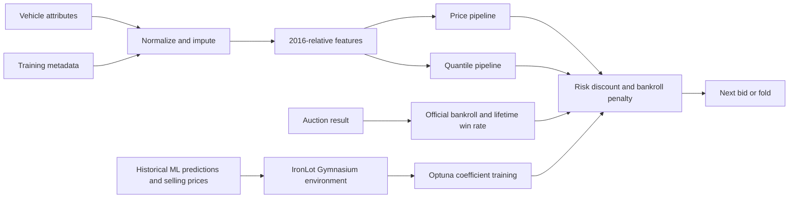

# IronLot: ML Valuation and Trained Auction Agent

A complete used-car auction bot built from two connected components: **ML valuation models** estimate price and downside risk, and a **trained auction agent** uses coefficients optimized in the IronLot auction environment to decide when and how much to bid. Reconstructed from the original academic submission, with its methodology, final agent and experiments preserved.

The original [PreyashPratyush_IronLot submission folder](PreyashPratyush_IronLot/README.md) contains the valuation notebook, the Gymnasium environment/agent-training notebook, and the final live-agent source. The supported Python package provides portable entry points for both ML training and auction-agent coefficient optimization.

## Contents

- [Problem and capabilities](#problem-and-capabilities)
- [Architecture](#architecture)
- [Preprocessing and feature engineering](#preprocessing-and-feature-engineering)
- [Models and bidding strategy](#models-and-bidding-strategy)
- [Setup](#setup)
- [Data and checkpoints](#data-and-checkpoints)
- [Recommended commands](#recommended-commands)
- [Training protocol and output artifacts](#training-protocol-and-output-artifacts)
- [Auction-agent training in the IronLot environment](#auction-agent-training-in-the-ironlot-environment)
- [Results and research history](#results-and-research-history)
- [Tests and continuous integration](#tests-and-continuous-integration)
- [Repository layout](#repository-layout)
- [Troubleshooting](#troubleshooting)
- [Limitations and reproducibility](#limitations-and-reproducibility)
- [Rights](#rights)

## Problem and capabilities

Vehicle prices vary with make, model, age, mileage and condition. The agent estimates resale value, discounts a bid for downside risk, reduces spending when capital falls, and modestly increases bids when its win rate is below 20%.

Implemented: vehicle normalization and missing-value imputation; categorical encoding; price and quantile prediction; live `analyze_item`, `place_bid` and `auction_result` interface; seeded ML training and evaluation; Gymnasium auction-agent coefficient training with Optuna; synthetic auction simulation. The agent is a trained deterministic bidding policy. There is no live marketplace connection, web service or neural reinforcement-learning policy.

The original research investigated two connected problems: predicting the selling price of a used car from tabular attributes, and choosing bids that balance purchase opportunities against downside risk and available capital. The final live agent is a deterministic policy whose coefficients were selected in historical simulation experiments.

| Capability | Supported implementation |
|---|---|
| Single-car valuation | JSON input → normalized features → price and quantile estimates |
| Live bidding | Return the next permitted bid or `0.0` to fold |
| State tracking | Official bankroll, number of wins, completed rounds, lifetime win rate |
| Model training | Baseline or stored tuned price parameters, plus a 0.1-quantile model |
| Auction-agent training | Optimize risk, bankroll and aggression coefficients in the original IronLot environment |
| Evaluation | R², RMSE and MAE on a caller-supplied labeled CSV |
| Auction simulation | Seeded English-auction harness with synthetic opponents |
| Research inspection | Preserved alternative strategies, notebooks and historical results |

## Architecture



Each model has its own scikit-learn `ColumnTransformer`: numeric passthrough, transmission one-hot encoding, and continuous target encoding for other categories. LightGBM estimates price and the conditional 0.1 quantile. The price-minus-quantile gap is a bidding heuristic, not a calibrated standard deviation.

The supported flow has three stages:

1. **Training:** split labeled rows, learn preprocessing statistics from training rows, fit two independently encoded model pipelines, evaluate the price model on the holdout, and save artifacts.
2. **Analysis:** normalize one vehicle using saved statistics, construct the original engineered features, and obtain price and quantile predictions.
3. **Bidding:** combine those predictions with the official bankroll and lifetime win rate; return the next 50-unit bid only when it fits the policy's ceiling.

Agent training connects the first and third stages: the IronLot environment consumes ML predictions, simulates auction outcomes, and supplies rewards to Optuna's search over the bidding-policy coefficients. The historical selected coefficients are embedded in the final live agent. ML-model weights and bidding-policy coefficients are different trained artifacts.

### Technology stack

| Technology | Role | Pinned core version |
|---|---|---|
| Python | Application, CLI and tests | Supported 3.10–3.12; verified locally on 3.10.0 |
| pandas | CSV loading, normalization and feature tables | 2.3.3 |
| NumPy / SciPy | Numerical operations and sklearn dependencies | 2.2.6 / 1.15.3 |
| scikit-learn | Encoders, pipelines, data split and metrics | 1.7.2 |
| LightGBM | Price and quantile gradient boosting | 4.6.0 |
| unittest | Regression and synthetic training checks | Python standard library |
| GitHub Actions | Configured Python test matrix | Python 3.10 and 3.12 |

Gymnasium and Optuna are required for auction-agent training and are installed by the `agent-training` extra. Matplotlib, Seaborn, CatBoost and JupyterLab are optional notebook/research dependencies. ML prediction and model training can use the smaller core installation.

## Preprocessing and feature engineering

Preprocessing is deliberately compatible with the submitted agent and its original checkpoints:

| Step | Implemented behavior |
|---|---|
| Identity | Missing make/model becomes the string `0`; the live agent then folds |
| Manufacturer normalization | Lowercase and strip whitespace, apply aliases such as `vw` → `volkswagen`, then title-case |
| Model normalization | Lowercase, remove hyphens and slashes, then title-case |
| Trim and body | Fill from saved per-make modes, then use `Unknown` if no mapping exists |
| Other categorical values | Missing transmission, color and interior become `Unknown` |
| Odometer | Fill with the saved training median |
| Condition | If missing, infer from mileage: ≤30000 → 4; ≤100000 → 3; ≤200000 → 2; otherwise 1 |
| Other defaults | Missing year → 2010; missing state → `va` |

Numeric values should be supplied as numbers, not formatted currency or mileage strings. These rules are historical heuristics; they do not infer a vehicle's actual mechanical condition.

| Engineered feature | Original definition |
|---|---|
| `years_used` | `2016 - year` |
| `miles_per_year` | `odometer / years_used` |
| `luxury_brands` | Membership in the original Rolls-Royce, Ferrari, Lamborghini, Bentley, Porsche and Aston Martin list |
| `is_rare` | Membership in the original Rolls-Royce and Lamborghini list |
| `depreciation` | `years_used * (condition / 5)` |

Age is anchored to 2016 for compatibility. A 2016 vehicle produces an infinite mileage-per-year value, and a later year produces negative age; both behaviors are retained and documented. Existing string capitalization and exact brand matching are also retained. Changing these features requires versioning and retraining rather than reusing original checkpoints.

## Models and bidding strategy

### Price and downside estimates

The price model is a LightGBM regressor trained on the selling-price target. The quantile model uses `objective="quantile"` and `alpha=0.1` to estimate a lower conditional price quantile. The models do not guarantee that the quantile prediction is below the price prediction, and quantile calibration has not been independently measured.

The stored tuned price configuration is:

| Parameter | Value |
|---|---:|
| `n_estimators` | 2400 |
| `max_depth` | 10 |
| `num_leaves` | 176 |
| `learning_rate` | 0.03038452742864471 |
| `min_child_samples` | 10 |

New baseline runs use LightGBM defaults for these parameters, including 100 trees. The quantile model uses its default 100 trees unless `--estimators` overrides both models. New runs set the random seed and use one LightGBM thread.

### Bid ceiling

Let `price` be the price estimate, `p10` the quantile estimate, `bankroll` the current official balance, and `win_rate` the lifetime fraction of completed auctions won:

```text
gap     = price - p10
base    = price - 0.1007 * gap
penalty = 0.3792 * max(0, 500000 - bankroll) / 500000 * price
boost   = 0.0125 * max(0, 0.2 - win_rate) * price
ceiling = min(base - penalty + boost, bankroll)
next    = current_highest_bid + 50
```

The agent returns `next` if it is within the ceiling and bankroll, otherwise `0.0`. It also folds before analysis or when make/model is missing. Invalid current bids and official bankrolls are rejected, and failed item analysis clears previous predictions so a prior car cannot supply a stale bid.

**Worked example:** price 15000, p10 12000, bankroll 500000, win rate 0 produces base 14697.90, penalty 0, boost 37.50 and ceiling **14735.40**. A current bid of 10000 yields **10050**; a current bid of 14700 requires 14750 and therefore yields **0**.

`auction_result` accepts the evaluator's new bankroll directly. `winning_bid` and `actual_price` are interface arguments; the agent does not calculate profit, deduct purchases, or add resale proceeds itself.

## Setup

Use Python **3.10–3.12**. Core numerical versions are pinned to the working local environment. From the repository root:

```powershell
git clone https://github.com/preyash309/car-auction-risk-agent.git
cd car-auction-risk-agent
```

This repository is private, so cloning requires GitHub access to it. In the existing reconstructed local workspace, skip cloning and use its project root.

```powershell
python -m venv .venv
.venv\Scripts\Activate.ps1
python -m pip install --upgrade pip setuptools
python -m pip install -e ".[agent-training]"
python -m unittest discover -s tests -v
python -m auction_bot --help
```

On Linux/macOS, activate with `source .venv/bin/activate`. The recommended `agent-training` installation supports the complete bot's model and agent-training workflows. Use `python -m pip install -e .` for ML inference/training only. Install `python -m pip install -e ".[research]"` for historical notebooks/experiments; their original execution paths are archival and may need adaptation. CI installs `agent-training` and tests both components on Python 3.10 and 3.12.

For an inference-oriented environment without an editable package install, `python -m pip install -r requirements.txt` installs the core dependency pins; run `python -m auction_bot` from the repository root. Editable installation also provides the `auction-bot` console command.

## Data and checkpoints

Neither the dataset nor binary checkpoints is published. See [data setup](data/README.md) and [checkpoint setup](checkpoints/README.md). The original workspace retains them, and canonical local copies were placed in `data/` and `checkpoints/`. A fresh clone can train new artifacts from an authorized dataset. There is no verified download source or redistribution license in the original evidence.

Input fields: `year`, `make`, `model`, `trim`, `body`, `transmission`, `state`, `condition`, `odometer`, `color`, `interior`. Supply every field; unknown values may be JSON `null`. CSV training/evaluation also requires `sellingprice`. The [example vehicle](examples/car.json) is synthetic.

### Example inference input

```json
{
  "year": 2013,
  "make": "ford",
  "model": "f-150",
  "trim": "xlt",
  "body": "supercrew",
  "transmission": "automatic",
  "state": "tx",
  "condition": 4.0,
  "odometer": 53070.0,
  "color": "white",
  "interior": "black"
}
```

Keep `sellingprice` out of inference input. Extra input fields are excluded by the supported agent. Missing field names cause a clear error; an explicitly unknown field is represented by `null`. The original notebook shows 447048 labeled rows and 12 columns; 438676 rows remained after missing make/model/target filtering in the newly verified baseline run.

### Two ways to obtain working models

1. **Existing local artifacts:** place the three trusted checkpoint files described in [checkpoint setup](checkpoints/README.md) together, then pass their directory to prediction or simulation.
2. **New training:** obtain an authorized CSV, place it under `data/`, train into a new `outputs/` directory, then use that directory as `--checkpoints`.

A fresh clone includes source, tests and the synthetic JSON example, but cannot run model-backed prediction until one of these asset paths is available. Core tests use synthetic models/data and can run without original assets.

## Recommended commands

```powershell
# Predict with trusted original or newly trained checkpoints
python -m auction_bot predict --item examples/car.json --checkpoints checkpoints --current-bid 10000

# Train the tuned model and quantile model; saves a seeded holdout split
python -m auction_bot train --data data/car_auction_train.csv --output outputs/tuned-seed42 --seed 42

# Faster baseline using LightGBM defaults
python -m auction_bot train --data data/car_auction_train.csv --output outputs/baseline-new --baseline --seed 42

# Caller must ensure this file is an independent evaluation set
python -m auction_bot evaluate --data data/holdout.csv --checkpoints outputs/tuned-seed42

# Synthetic opponents; this is not a real-market benchmark
python -m auction_bot simulate --data data/car_auction_train.csv --checkpoints checkpoints --rounds 500 --seed 42
```

`data/holdout.csv` is a user-supplied file, not included. All commands exist; prediction, simulation, evaluation, package installation and baseline training are covered by local verification recorded in [VALIDATION.md](docs/VALIDATION.md). A full 2,400-tree tuned retraining was not executed during reconstruction. For a short training smoke run, add `--estimators 2`.

Output directories must be empty or new to prevent overwriting checkpoints. Training saves the three compatible pickle names, `metrics.json` (holdout metrics, seed, dataset hash), and `split.json` (source CSV row IDs). It does not refit on the full dataset. Paths are relative to the current directory; run from the root or use absolute paths. `AUCTION_CHECKPOINT_DIR` can set the default asset directory; `.env.example` is a shell template and is not loaded automatically.

### Live integration

```python
from auction_bot import LiveAuctionAgent
import json

with open("examples/car.json", encoding="utf-8") as stream:
    vehicle_attributes = json.load(stream)

agent = LiveAuctionAgent(checkpoint_dir="checkpoints")
agent.analyze_item(vehicle_attributes)
bid = agent.place_bid(current_highest_bid=10000.0)  # 0 means fold
agent.auction_result(won=True, winning_bid=bid,
                     actual_price=22000.0, current_bankroll=501000.0)
```

The evaluator supplies the official updated bankroll; the agent does not calculate settlement itself. Initial bankroll is 500,000 and bid increment is 50. Trusted pickle files only: loading a pickle can execute code.

### CLI reference

| Command | Required arguments | Optional arguments and defaults |
|---|---|---|
| `predict` | `--item PATH` | `--checkpoints DIR`, `--current-bid 0` |
| `train` | `--data CSV`, `--output DIR` | `--seed 42`, `--baseline`, `--estimators N` |
| `evaluate` | `--data CSV` | `--checkpoints DIR` |
| `simulate` | `--data CSV` | `--checkpoints DIR`, `--rounds 500`, `--seed 42` |

Run `python -m auction_bot COMMAND --help` for each command's arguments. JSON results go to standard output; input/path errors produce an error message and exit code 2. Numerical library warnings can appear on standard error.

For checkpoint lookup, an explicit directory takes precedence over `AUCTION_CHECKPOINT_DIR`, followed by `checkpoints` relative to the current working directory. Set the environment default in PowerShell with `$env:AUCTION_CHECKPOINT_DIR="checkpoints"` or in a POSIX shell with `export AUCTION_CHECKPOINT_DIR=checkpoints`.

## Training protocol and output artifacts

The reconstructed training path is designed for new reproducible runs:

1. Read the CSV, require all input fields plus `sellingprice`, and exclude extra columns.
2. Remove rows missing make, model or target; require at least 10 remaining rows and finite targets.
3. Perform a seeded random 80/20 row split, retaining original CSV row positions.
4. Derive manufacturer-specific trim/body modes and odometer median from training rows only.
5. Apply the checkpoint-compatible normalization/features to both splits using those training statistics.
6. Fit separate price and quantile pipelines with independently owned encoders.
7. Calculate price-model R², RMSE and MAE on the holdout and save artifacts. No full-data refit occurs.

| Output file | Contents |
|---|---|
| `model_PreyashPratyush.pkl` | Fitted price pipeline and its encoders |
| `quantile_PreyashPratyush.pkl` | Fitted quantile pipeline and its encoders |
| `others_PreyashPratyush.pkl` | Cleanup map, trim/body maps and odometer median |
| `metrics.json` | Holdout scores, row counts, seed, dataset SHA256, actual model parameters and numerical library versions |
| `split.json` | Training and holdout source CSV row positions |

Save the input CSV unchanged alongside its hash and retain the run directory privately to reconstruct an evaluation split. `evaluate` does not automatically use `split.json`: supply a CSV containing the intended evaluation rows. Evaluating the entire training CSV produces descriptive metrics with training overlap, not an independent benchmark.

The current training command evaluates the price model only. It does not report quantile pinball loss, quantile coverage, bidding-policy profitability, or perform a new Optuna search. Historical optimization code and objectives are preserved in [EXPERIMENTS.md](EXPERIMENTS.md).

## Auction-agent training in the IronLot environment

The auction agent was trained through bidding-coefficient optimization in [environment_Preyash_Pratyush.ipynb](PreyashPratyush_IronLot/environment_Preyash_Pratyush.ipynb). That notebook defines `CarAuctionEnv`, an Optuna objective, the selected bidding weights, and a subsequent five-agent Monte Carlo evaluation. [agent_PreyashPratyush.py](PreyashPratyush_IronLot/agent_PreyashPratyush.py) is the original final agent connecting those weights to the fitted price/quantile models.

### Environment mechanics

| Component | Original behavior |
|---|---|
| Input | Cached rows with `sellingprice`, `pred` and `std`; `std` is price prediction minus quantile prediction |
| Observation | Price prediction, predicted gap, bankroll, round number and recent win rate |
| Starting bankroll / episode | 500000 / 500 cars, ending sooner on bankruptcy |
| Recent win rate | Last 50 auction outcomes |
| Action | Maximum acceptable bid for one car, rather than the live API's next incremental bid |
| Opponent | True selling price plus Normal noise with scale 10% of that price |
| Settlement | If bid exceeds rival bid and the purchase is affordable, pay rival+50 and immediately resell at true price |
| Reward | Resale profit; zero when losing; negative remaining bankroll for an unaffordable purchase |
| Training objective | Maximize mean final bankroll across 100 games per trial |
| Historical search | 500 trials specified in a commented notebook invocation; original trial database absent |

The historical search ranges are alpha **0.1–1.5**, beta **0–0.5**, and boost weight **0–0.05**. The boost is called `delta` in the Optuna parameters and `GAMMA` in the final agent. Recorded selected coefficients are **alpha=0.1007**, **beta=0.3792**, **gamma=0.0125**. They control risk discount, capital stress and aggression in the [bid formula](#bid-ceiling).

The supported [environment module](auction_bot/environment.py) retains the actual notebook opponent/reward equations. It adds seeded sampling/noise, Gymnasium spaces and a safe terminal observation. The [optimization module](auction_bot/optimize.py) preserves the historical objective formula, including its unclamped capital penalty, but folds negative bid proposals to zero. It uses a seeded Optuna sampler, fixed episode seeds across trials, one worker and persistent study output. These reproducibility/safety changes are documented rather than presented as an exact replay of the unseeded study.

### Prepare cached predictions

An authorized prediction CSV is needed. The original local `new/test.csv` already has the required columns; it is not included in GitHub. To generate a new cache from authorized vehicle data and trusted checkpoints, run this Python code from the project root:

```python
import pandas as pd
from auction_bot import LiveAuctionAgent
from auction_bot.training import read_dataset, prepare

agent = LiveAuctionAgent("checkpoints")
cars = read_dataset("data/car_auction_train.csv")
features = prepare(cars, agent.others)
prices = agent.model.predict(features)
quantiles = agent.quantile.predict(features)
pd.DataFrame({
    "sellingprice": cars["sellingprice"].to_numpy(),
    "pred": prices,
    "std": prices - quantiles,
    "quantile": quantiles,
}).to_csv("data/auction_predictions.csv", index=False)
```

Prediction caching over the entire dataset can take time. Use an independent dataset for evaluating generalization; a cache containing model-training rows is suitable only for a clearly labeled overlapping-data experiment.

### Run coefficient optimization

```powershell
# Full historical search dimensions; newly seeded run, potentially expensive
python -m auction_bot.optimize --data data/auction_predictions.csv --output outputs/ironlot-search --trials 500 --games 100 --rounds 500 --seed 42

# Small smoke run for checking the environment and study export
python -m auction_bot.optimize --data data/auction_predictions.csv --output outputs/ironlot-smoke --trials 2 --games 2 --rounds 10 --seed 42
```

Arguments `--data` and `--output` are required; trials/games/rounds/seed default to 500/100/500/42. Outputs must go to an empty/new directory. The command saves:

- `study.sqlite3`: the complete newly generated Optuna study and trial history.
- `trials.csv`: a table of trial parameters and objective values.
- `policy.json`: selected coefficients, objective score, search dimensions, seed, dataset hash, numerical versions and protocol description.

New optimization results do not automatically change the submitted live-agent coefficients. Review and validate a newly selected policy before changing deployment behavior. The original notebook environment uses a recent win window and permits negative capital stress above starting bankroll; the final live agent uses lifetime wins and clamps stress at zero. The English-auction `simulate` command is a different evaluation harness, not this training environment.

The complete workflow is therefore **train/load ML models → prepare prediction cache → train/evaluate bidding coefficients in IronLot → run the final auction agent**. Existing original checkpoints and coefficients remain compatible. The full historical 500×100×500 search was not rerun during integration; only targeted tests and a small cached-data smoke search were executed.

## Results and research history

Stored notebook output reports baseline R² **0.912861**, RMSE **2,902.20**; tuned R² **0.953791**, RMSE **2,096.46**. These are historical, unseeded results, not independently reproduced. The report's tuned RMSE **2,244.34** disagrees with notebook output. Historical Monte Carlo results and their statistical limitations are detailed in [EXPERIMENTS.md](EXPERIMENTS.md). Newly verified results are separate in [VALIDATION.md](docs/VALIDATION.md).

### Verified reconstruction results

| Check | Observed result | Interpretation |
|---|---|---|
| New baseline, seed 42 | R² 0.9217397391; RMSE 2669.6258349; MAE 1698.8989573 | 350940 training rows, 87736 holdout rows; train-only preprocessing |
| Original-checkpoint example | Price 21606.4186142; p10 17090.3446864; bid 10050 from current 10000 | A smoke prediction for the supplied synthetic vehicle |
| Original-checkpoint simulation, seed 42 | 500 sampled; 9 skipped; 304 wins out of 491 auctioned; bankroll 641107.5452 | Synthetic true-price-based opponents and immediate resale; possible training overlap |
| Regression and environment suite | 17 tests passed with local checkpoints and agent-training dependencies | Checks model/agent compatibility, original environment transitions and seeded optimization, not economic profitability |

The new baseline and historical tuned scores use different splits and preprocessing protocols, so they do not form a controlled model comparison. No claim is made that the new baseline improves on, or reproduces, historical research results.

Historical notebook simulation reports a mean bankroll of 522587.52 and a 2.5–97.5 percentile range of 486960.19–568090.14 over 10000 games. This is an outcome percentile range; it does not prove a 95% chance of profit. The original trial histories, split IDs and full model provenance are not available.

### Preserved alternatives

- Earlier pricing with model-frequency rarity, instead of the final brand-based feature.
- Noisy single-rival tuning and five-agent Monte Carlo strategy comparison.
- Margin-based bidding optimized for profit, stability and wins.
- Synthetic and dataset-backed English-auction harnesses.
- The example agent interface and an unrelated conversion-classification experiment, clearly separated from supported auction execution.

These alternatives are evidence of the project's development, not interchangeable supported entry points. No systematic feature-removal ablation scores were found or fabricated.

## Tests and continuous integration

Run the asset-independent suite after installation:

```powershell
python -m unittest discover -s tests -v
```

With `.[agent-training]` installed, it runs 17 tests: 16 pass without private assets, and the original-checkpoint test explicitly skips. A core-only installation also skips the seven optional environment/optimization tests. To include the checkpoint test on a machine with trusted original checkpoints:

```powershell
$env:AUCTION_TEST_CHECKPOINTS="checkpoints"
python -m unittest discover -s tests -v
```

The suite covers submitted-preprocessing equality; bid equality across bankroll, win-rate and bid states; missing identity; invalid inputs and stale-state protection; official result tracking; missing-asset diagnostics; independent encoders; training-only metadata; synthetic training, saved split and artifact reload; output overwrite protection; and deterministic simulation counts/seeds.

IronLot tests additionally compare the notebook's economic transitions and tuning formula, check Gymnasium's environment contract, seeded sampling/noise, bankruptcy rewards, final-row termination, invalid actions/data, deterministic study results and persisted artifacts.

[The CI workflow](.github/workflows/ci.yml) installs the package with agent-training dependencies, runs model/agent/environment tests and checks both CLIs on Linux/Python 3.10 and 3.12. Original datasets and checkpoints are excluded from CI, so the private-asset test skips there. Local verification is documented in [VALIDATION.md](docs/VALIDATION.md); remote CI status should be checked in the repository's Actions tab.

## Repository layout

```text
auction_bot/             supported preprocessing, agent, training, CLI, simulation
examples/car.json        synthetic inference input
tests/                   regression and synthetic training tests
experiments/archive/     original scripts, unsupported historical paths
PreyashPratyush_IronLot/ original valuation/environment notebooks and final agent
data/                    schema and setup; datasets ignored
checkpoints/             asset setup; pickle files ignored
docs/                    migration, validation, security and asset manifest
.github/workflows/       core Python CI
```

The original `new/`, `trainingmodels.py`, `catboost_info/` and full `.reconstruction/` backup remain local and ignored. See [migration map](docs/MIGRATION.md).

| Module | Responsibility |
|---|---|
| `auction_bot/agent.py` | Checkpoint loading, item analysis, policy state and bidding interface |
| `auction_bot/preprocessing.py` | Original normalization, imputation and engineered features |
| `auction_bot/training.py` | Dataset checks, train-only metadata, model fitting, metrics and artifact export |
| `auction_bot/simulation.py` | Seeded English-auction smoke harness |
| `auction_bot/environment.py` | IronLot Gymnasium auction environment for bidding-policy training |
| `auction_bot/optimize.py` | Seeded Optuna bidding-coefficient training and persistent study export |
| `auction_bot/cli.py` | Argument parsing and JSON command results |

The original local recovery archive contains all 19223 initial files with a hashed inventory; all seven later supplied IronLot files were also backed up. Neither backup nor the machine-specific Python environment is included in GitHub. Published IronLot notebooks retain code and narrative while removing outputs, dataset previews and cloud metadata; untouched originals remain in the local backup. Earlier published duplicate notebooks and submitted-agent copies were consolidated into the named IronLot folder.

## Troubleshooting

| Symptom | Resolution |
|---|---|
| `Missing checkpoints ...` | Supply all three compatible files in one directory, or train a new run and pass its output directory |
| `Missing vehicle fields ...` | Include every required JSON field; use `null` for unknown values |
| `Dataset missing columns ...` | Match the schema in [data setup](data/README.md), including `sellingprice` for training/evaluation |
| Training output is not empty | Choose a new output directory; the CLI protects previous checkpoint files |
| `No module named auction_bot` | Activate the intended environment, install with `python -m pip install -e .`, or run from the repository root |
| Editable installation unsupported | Upgrade project-environment pip and setuptools using the setup commands |
| `No module named gymnasium` or `optuna` | Install `python -m pip install -e ".[agent-training]"` for the auction-agent training workflow |
| Environment input columns missing | Supply a prediction cache with `sellingprice`, `pred` and `std`, not only raw vehicle attributes |
| Simulation requests more rows than available | Lower `--rounds` or supply more labeled rows |
| Feature-name or pandas downcasting warnings | See the recorded legacy warnings in [VALIDATION.md](docs/VALIDATION.md); keep pinned versions for compatibility |
| Prediction is unexpectedly low/high | Check units, input types, missing identity, the 2016 age reference and whether the car is represented by the training distribution |

Paths are resolved from the current working directory. Use absolute paths when launching outside the root. Original archival scripts retain old filenames and import side effects; use the package CLI for supported execution.

## Limitations and reproducibility

- Legacy features intentionally use reference year **2016**, including division by zero for 2016 models. Infinity/negative age behavior and brand string capitalization are preserved for checkpoint compatibility; this model is not a current-year valuation service.
- Missing make/model folds. Empty strings and out-of-distribution vehicles can still produce unreliable values; there is no calibration guarantee.
- Historical preprocessing and split handling had methodological inconsistencies. New training fits imputation on training only, seeds the split/encoders/model, and uses separate encoder objects; new metrics cannot be equated with old ones.
- Original row splits, Optuna trial histories and checkpoint-training provenance are unavailable. Historical metrics cannot be exactly reproduced. Preserved notebooks are research evidence, not the recommended runnable path.
- Simulation uses hypothetical bids tied to true selling price and immediate resale. It ignores fees, holding costs and inventory capital, and may reuse training rows.
- Tests verify behavior and checkpoint compatibility; they do not validate financial profitability. Numerical warnings from legacy pandas/sklearn behavior are recorded in validation notes.

Future work: independent time-based evaluation, quantile calibration, calibrated auction opponents, inventory/fees, persisted optimization studies and a versioned current-year feature schema with retraining.

## Rights

No original license was found. No new open-source license or dataset/model redistribution grant is asserted. The private repository preserves code for the account owner's review; dependencies retain their respective upstream licenses. See [publication hygiene](docs/SECURITY.md).
