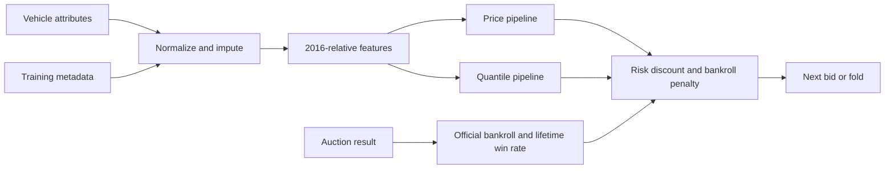

# Car Auction Risk Agent

A used-car valuation model and auction bidding agent that combines a LightGBM price estimate, a 10th-percentile price estimate, and bankroll-aware bidding. Reconstructed from an academic auction project, with the original experiments preserved and a portable Python execution path.

## Problem and capabilities

Vehicle prices vary with make, model, age, mileage and condition. The agent estimates resale value, discounts a bid for downside risk, reduces spending when capital falls, and modestly increases bids when its win rate is below 20%.

Implemented: vehicle normalization and missing-value imputation; categorical encoding; price and quantile prediction; live `analyze_item`, `place_bid` and `auction_result` interface; seeded training and evaluation; synthetic auction simulation. There is no live marketplace connection, web service or learned reinforcement-learning policy.

## Architecture



Each model has its own scikit-learn `ColumnTransformer`: numeric passthrough, transmission one-hot encoding, and continuous target encoding for other categories. LightGBM estimates price and the conditional 0.1 quantile. The price-minus-quantile gap is a bidding heuristic, not a calibrated standard deviation.

## Setup

Use Python **3.10–3.12**. Core numerical versions are pinned to the working local environment. From the repository root:

```powershell
python -m venv .venv
.venv\Scripts\Activate.ps1
python -m pip install --upgrade pip setuptools
python -m pip install -e .
python -m unittest discover -s tests -v
python -m auction_bot --help
```

On Linux/macOS, activate with `source .venv/bin/activate`. Install `python -m pip install -e ".[research]"` only for historical notebooks/experiments; their original execution paths are archival and may need adaptation. CI runs core tests on Python 3.10 and 3.12.

## Data and checkpoints

Neither the dataset nor binary checkpoints is published. See [data setup](data/README.md) and [checkpoint setup](checkpoints/README.md). The original workspace retains them, and canonical local copies were placed in `data/` and `checkpoints/`. A fresh clone can train new artifacts from an authorized dataset. There is no verified download source or redistribution license in the original evidence.

Input fields: `year`, `make`, `model`, `trim`, `body`, `transmission`, `state`, `condition`, `odometer`, `color`, `interior`. Supply every field; unknown values may be JSON `null`. CSV training/evaluation also requires `sellingprice`. The [example vehicle](examples/car.json) is synthetic.

## Recommended commands

```powershell
# Predict with trusted original or newly trained checkpoints
python -m auction_bot predict --item examples/car.json --checkpoints checkpoints --current-bid 10000

# Train the tuned model and quantile model; saves a seeded holdout split
python -m auction_bot train --data data/car_auction_train.csv --output outputs/tuned-seed42 --seed 42

# Faster baseline using LightGBM defaults
python -m auction_bot train --data data/car_auction_train.csv --output outputs/baseline-new --baseline --seed 42

# Caller must ensure this file is an independent evaluation set
python -m auction_bot evaluate --data data/holdout.csv --checkpoints outputs/tuned-seed42

# Synthetic opponents; this is not a real-market benchmark
python -m auction_bot simulate --data data/car_auction_train.csv --checkpoints checkpoints --rounds 500 --seed 42
```

`data/holdout.csv` is a user-supplied file, not included. All commands exist; prediction, simulation, evaluation, package installation and baseline training are covered by local verification recorded in [VALIDATION.md](docs/VALIDATION.md). A full 2,400-tree tuned retraining was not executed during reconstruction. For a short training smoke run, add `--estimators 2`.

Output directories must be empty or new to prevent overwriting checkpoints. Training saves the three compatible pickle names, `metrics.json` (holdout metrics, seed, dataset hash), and `split.json` (source CSV row IDs). It does not refit on the full dataset. Paths are relative to the current directory; run from the root or use absolute paths. `AUCTION_CHECKPOINT_DIR` can set the default asset directory; `.env.example` is a shell template and is not loaded automatically.

### Live integration

```python
from auction_bot import LiveAuctionAgent

agent = LiveAuctionAgent(checkpoint_dir="checkpoints")
agent.analyze_item(vehicle_attributes)
bid = agent.place_bid(current_highest_bid=10000.0)  # 0 means fold
agent.auction_result(won=True, winning_bid=bid,
                     actual_price=22000.0, current_bankroll=501000.0)
```

The evaluator supplies the official updated bankroll; the agent does not calculate settlement itself. Initial bankroll is 500,000 and bid increment is 50. Trusted pickle files only: loading a pickle can execute code.

## Results and research history

Stored notebook output reports baseline R² **0.912861**, RMSE **2,902.20**; tuned R² **0.953791**, RMSE **2,096.46**. These are historical, unseeded results, not independently reproduced. The report's tuned RMSE **2,244.34** disagrees with notebook output. Historical Monte Carlo results and their statistical limitations are detailed in [EXPERIMENTS.md](EXPERIMENTS.md). Newly verified results are separate in [VALIDATION.md](docs/VALIDATION.md).

## Repository layout

```text
auction_bot/             supported preprocessing, agent, training, CLI, simulation
examples/car.json        synthetic inference input
tests/                   regression and synthetic training tests
experiments/archive/     original scripts, unsupported historical paths
experiments/notebooks/   original notebook code/markdown, outputs removed
data/                    schema and setup; datasets ignored
checkpoints/             asset setup; pickle files ignored
docs/                    migration, validation, security and asset manifest
.github/workflows/       core Python CI
```

The original `new/`, `trainingmodels.py`, `catboost_info/` and full `.reconstruction/` backup remain local and ignored. See [migration map](docs/MIGRATION.md).

## Limitations and reproducibility

- Legacy features intentionally use reference year **2016**, including division by zero for 2016 models. Infinity/negative age behavior and brand string capitalization are preserved for checkpoint compatibility; this model is not a current-year valuation service.
- Missing make/model folds. Empty strings and out-of-distribution vehicles can still produce unreliable values; there is no calibration guarantee.
- Historical preprocessing and split handling had methodological inconsistencies. New training fits imputation on training only, seeds the split/encoders/model, and uses separate encoder objects; new metrics cannot be equated with old ones.
- Original row splits, Optuna trial histories and checkpoint-training provenance are unavailable. Historical metrics cannot be exactly reproduced. Preserved notebooks are research evidence, not the recommended runnable path.
- Simulation uses hypothetical bids tied to true selling price and immediate resale. It ignores fees, holding costs and inventory capital, and may reuse training rows.
- Tests verify behavior and checkpoint compatibility; they do not validate financial profitability. Numerical warnings from legacy pandas/sklearn behavior are recorded in validation notes.

Future work: independent time-based evaluation, quantile calibration, calibrated auction opponents, inventory/fees, persisted optimization studies and a versioned current-year feature schema with retraining.

## Rights

No original license was found. No new open-source license or dataset/model redistribution grant is asserted. The private repository preserves code for the account owner's review; dependencies retain their respective upstream licenses. See [publication hygiene](docs/SECURITY.md).
